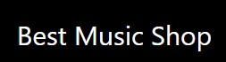
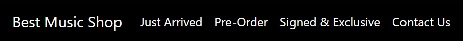
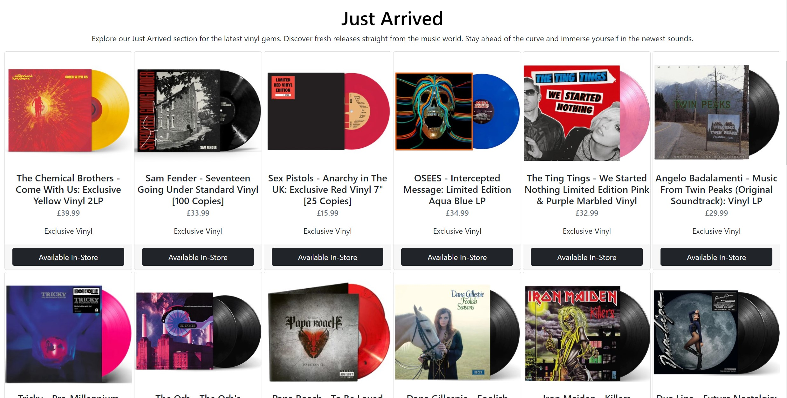
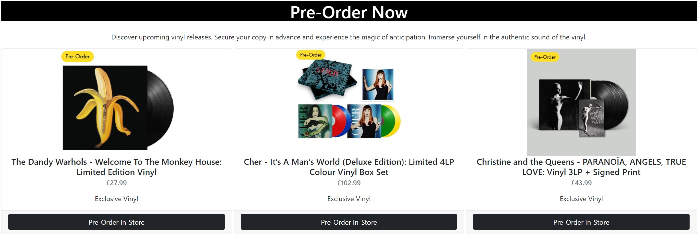
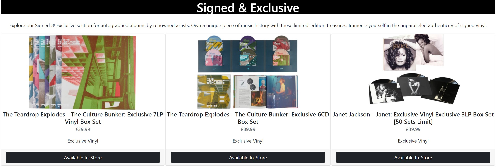
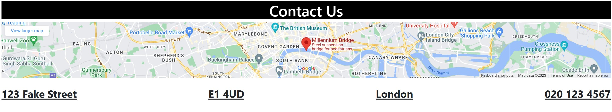
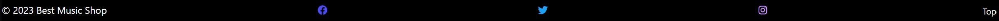

# **Best Music Shop**
## **Site Overview**
Welcome to Best Music Shop, your ultimate destination for vinyl enthusiasts. Explore our curated online showcase of rare records, read album descriptions, and immerse yourself in the beauty of vinyl. Join our vibrant community of collectors and stay updated on exclusive events. Remember, the magic truly comes alive in our brick-and-mortar store. Start your vinyl journey today, both online and in-store.

## Table of contents:
1. [**Site Overview**](#site-overview)
1. [**Planning stage**](#planning-stage)
    * [***Target Audiences***](#target-audiences)
    * [***User Stories***](#user-stories)
    * [***Site Aims***](#site-aims)
    * [***How Is This Will Be Achieved:***](#how-this-will-be-achieved)
    * [***Wireframes***](#wireframes)
    * [***Color Scheme***](#color-scheme)
1. [**Current Features Common to all pages**](#current-features-common-to-all-pages)
    * [***Header Element:***](#header-element)
        * [*Title*](#title)
        * [*Logos*](#logos)
        * [*Navigation Bar*](#navigation-bar)
    * [**Disc image:**](#disc-image)
      * [***Just Arrived***:](#just-arrived)
          * [*disc-image*](#disc-image)
      * [***Pre-Order***:](#pre-order)
          * [*disc-image*](#disc-image-1)
      * [***Signed & Exclusive***](#signed-exclusive)
          * [*disc-image*](#disc-image-2)
      * [***Contact Us***](#contact-us)
          * [*disc-image*](#disc-image-3)
    * [**Footer**](#footer)
1. [**Future-Enhancements**](#future-enhancements)
1. [**Testing Phase**](#testing-phase)
1. [**Deployment**](#deployment)
1. [**Credits**](#credits)
    * [**Honorable mentions**](#honorable-mentions)
    * [**General reference**](#general-reference)
    * [**Content**](#content)
    * [**Media**](#media)

## **Planning stage**
### **Target Audiences:**
* Users craving for genuine sounds but fails to find them in ordinary music-player. 
* Users with a general interest in vinyls and want to learn more.
* Users who have never tried listening to vinyls.

### **User Stories:**
* As a user, I want to see the available in-store stock.
* As a user, I want to navigate the page to find what I require quickly and easily.
* As a user, I want to leave a retro feeling.
* As a user, I was to be able to navigate my way to free resources easily.
* As a user, I want to know upcoming vinyl releases. 

### **Site Aims:**
* To show available stock.
* To an easy navigation on all sections.
* Provide the user with the information required to find us.
* Provide a method by which the user can subscribe to a newsletter.

### **How This Will Be Achieved:**
* The main page offers sections for each category of vinyls from the basic ones to the signed & exclusive ones.

* The site informations such as
    * Our store location.
    * Stock availability & Prices.

* Providing a newsletter to which the user can subscribe by using the email address and by clicking the submit button.

### **Wireframes:**
To organize my thoughts and prevent scope creep, I created wireframes for this project. Below are links to each of the mobile and desktop version.

* Mobile Wireframes:
    * [Homepage (index.html)](docs/screenshots/wirefram2.jpg)

* Desktop wireframes:
    * [Homepage (About)](docs/screenshots/wireframe1.jpg)

There was some deviation from the original wireframes to improve the overall User Experience.

* The inclusion of a disc image on each page to improve uniformity across all pages.
* I mainly used images to showcase avaiable discs.
* Headings and content placement to allow for the flow of information to be relevant.
* The website was supposed to have pages instead of section but I found it to be more fluent and user friendly using sections.

### **Color Scheme:**
When deciding the color scheme, I wanted to go with something that gave an retro appearance. For this reason, I have used mostly non-colors with the minority colors being grey.

## **Current Features Common to all pages**
###  **Header Element**
The header element sits at the top of the page offering a smooth scroll like action when pressing on any section.

#### *Title:*

* The title serves to state the name of the shop.
* It also serves as a navigation link to the home page.

#### *Logos:*
* No logo was used as a simple text feels more retro.

#### *Navigation Bar:*
* The navigation bar appears on all three pages. 
* It contains links to the just arrived, pre-order, signed & exclusive, and contact us section to allow easy navigation around the website. 
* The below image shows the user's current page highlighted in blue with a white border. 
* Hover over feature, which turns the menu option the same as the active page when users hover their cursor over the navbar heading.

***
### **Disc image**
* I have included the main image on each page to make the site uniform across all pages. 

### **Just-Arrived:**
First and the most used section as It showcase only new vinyls.
#### *Disc-image:*
Just-Arrived section preview.

### **Pre-Order:**
Second section which showcase upcoming vinyl releases.
#### *disc-image:*
Pre-Order section preview.

### **Signed & Exclusive:**
Third section which showcase limited vinyls.
#### *disc-image:*
Signed & Exclusive section preview.

### **Contact Us:**
Last section which offers informations about the location of the best shop.
#### *disc-image:*
The artwork pictures three of the common deities used within the New Kadampa Tradition. I used this to be eye-catching even when viewed from smaller devices.

## **Footer**
* The footer includes direct links to all BMS social media accounts with an invitation to connect to the BMS directly via these channels.

* These icons were imported from font awesome using Javascript at the bottom of the page. I was advised that linking the CDN in the header would load faster; however, the lighthouse tools in devtools showed a different story as the performance score became negatively affected by the CDN link.

* Button to get you back to the top of the page.

## **Future-Enhancements**

* The future intention of the site would be making delivery available world-wide.

* At first, we should start delivering locally and slowly expand: -

    * Start in the close areas such as Central London for a small fee.
    * Raise the delivery fee a bit more for Outer London.
    * Open Stores outside of London (Manchester, Leeds, Ipswich etc).

* Eventually, when we can cover a wider area we will: -

    * Cap the delivery fee to an average between all of them (small,medium).
    * Offer the posibility of people outside of London to visit us in other stores (Manchester, Leeds etc..).
    * Schedule different events with prizes.

* Once I understand JavaScript more I would like to add a basket where products can be stored.

* I would also make the contact form fully function with a post request and have a database to collate data for the mailing list.
***
## **Testing Phase**
I have included details of testing both during development and post development in a separate document called [TESTING.md](TESTING.md).
***
## **Deployment**
I deployed the page on GitHub pages via the following procedure: -

1. From the project's [repository](https://github.com/cristihell23/Milestone-Project-1#assetsimagesdsk-1jpg), go to the **Settings** tab.
2. From the left-hand menu, select the **Pages** tab.
3. Under the **Source** section, select the **Main** branch from the drop-down menu and click **Save**.
4. A message will be displayed to indicate a successful deployment to GitHub pages and provide the live link.

***
## **Credits**
### **Honorable mentions**
This project could not have happened without the support of the following people listed in no particular order:

* [Richard Wells](https://github.com/D0nni387) - Best Code Institute Mentor who has gone above and beyond what was expected of him to help me get this far in the course. I can clearly see how I am becoming a better developer.  
* My friend group as a whole who tested and supported throughout.

### **General reference:**
* Used this website as a reference.Similarities might be found as in aspect but not in code. [TheSoundOfVinyl](https://thesoundofvinyl.com)
* I relied upon W3schools, Bootstrap 5 doc, many tears and stack overflow for general references throughout the project.

### **Content:**
* Most of the content was written by myself.
* Icons in the footer were taken from [Font Awesome](https://fontawesome.com)
* Icons used on wireframes https://www.figma.com/file/Of2Eh1kfhkMo5KNBcI3P4A/Evericons-(Copy)?type=design&node-id=0-1&t=3abTJKcbdVdRjDNf-0
* Accessibility checker - [WAVE - Web accessibility evaluation tool](https://wave.webaim.org/)
  
### **Media:**
* Images used for Card classes were taken from [TheSoundOfVinyl](https://thesoundofvinyl.com)