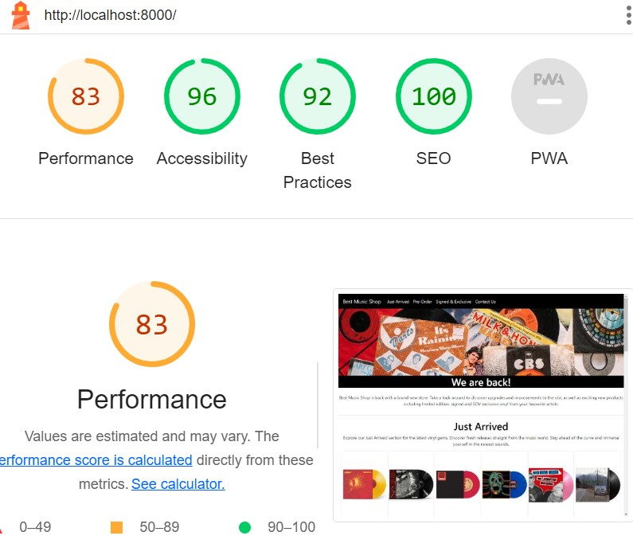
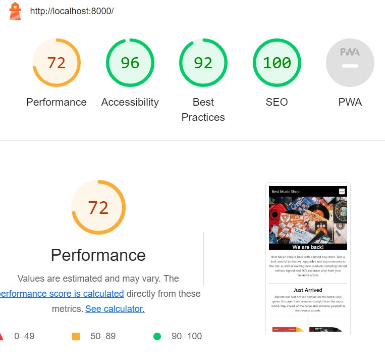

# Testing Page Table of Contents
* [**During Development Testing**](#during-development-testing)
    * [*Manual Testing*](#manual-testing)
* [**Post Development Testing**](#post-development-testing)
  * [**Validators**](#validators)
      * [*HTML*](#html---httpsvalidatorw3orgnu)
      * [*CSS*](#css---httpsjigsaww3orgcss-validator)
  * [**Lighthouse Scores**](#lighthouse-scores)
      * [*Desktop Version:*](#light)
      * [*Mobile Version*](#mobile-version)
      * [*Lighthouse Score Feedback From Third Party Testers*](#lighthouse-score-feedback-from-third-party-testers)
  * [**Accessability**](#accessability)

## **During Development Testing**
During the development process, I was manually testing in the following ways:-

1. Manually testing each element for appearance and responsiveness via a simulated live server using an extension in VSCode.
    
1. Asked a few friends to test and received feedback.

### ***Manual Testing:***
* During testing, I used four different browsers to ensure cross-compatibility. The desktop browsers used by myself were:

  1. Chrome
  2. Firefox  
  3. Opera
  4. Edge

* I then used the devtools to simulate different screen sizes/devices from 320 px up to 4000px in width

### **Validators**

#### ***HTML*** - https://validator.w3.org/nu/

* ***Issue Found:***
    * My solution to point 6 of the "During Development Testing" section cause an error because I used a semantic tag ("section") on the community page with no heading. I had originally split the page into three sections leaving the two articles in a section by themselves. 
* ***Solution Used:***
    * I extended the section tag with the ID "ways-to-connect" to include the articles on the page and changed the third section tag containing the two articles into a div element within #ways-to-connect. All pages now return no error.

#### ***CSS*** - https://jigsaw.w3.org/css-validator/

* All pages tested, no issues found via URL or file upload.\

### **Lighthouse Scores**
### **Test conditions**
* I ran the tests for both mobile and desktop. 
* I asked people to run lighthouse tests from their own devices. 
#### ***Desktop Version:***
I have only included one screenshot for desktop as all pages were the same score, only changing by one or two points in performance if I ran it multiple times. 

 

**There were several actions required to get to this score:**

1. The initial SEO score was 83.

1. The best practice score was first 92 and impacted by two factors:
    * Aspect ratio of the images.

    * Maps embed link.

1. The performance was 92 on the form feedback page but fluctuating around 92 each time I ran the test.

#### ***Mobile Version:***

* Performance wise the mobile version was on the worse side with a fluctuating around 72 each time I ran the test. I believe compressing the images would have raised the performance significantly.

1. ***index.html:***

    

    * The performance score on the page was around 72.

### **Accessability**
In addition to the accessability score on light house I also used [WAVE - Web accessability evaluation tool](https://wave.webaim.org/) to check my pages for accessability and no errors were returned.
***   
[return to README.md](README.md)